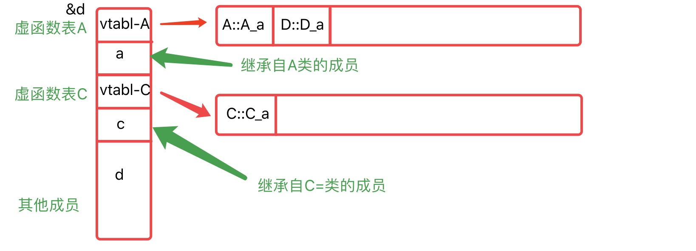

## C++ 虚函数原理

通过对象内存中的虚函数表指针 vptr 找到虚函数表 vtbl, 再通过 vtbl 找到对应虚函数的实现区域并进行调用，被执行的代码必须和调用函数的对象的动态类型一致。当一个类声明了虚函数或者继承了虚函数，这个类就会有自己的 vtbl。vtbl 的核心就是一个函数指针数组。vtbl 数组中的每一个元素对应一个函数指针指向该类的一个虚函数，同时该类的每个对象都会包含一个 vptr，vptr 指向该 vtbl 的地址。

有继承关系时：

* 子类的虚函数表现将现将父类虚函数指针放在前面，再放自己的虚函数指针。
* 如果子类覆盖了父类的虚函数，子类的虚函数指针将被放到原来父类虚函数的位置。
* 在多继承的情况下， **每个父类都有自己的虚表，子类的成员函数被放到了第一个父类的表中。** 也就是说当类在多重继承中时，其实例对象的内存结构并不只记录一个虚函数表指针。基类中有几个存在虚函数，则子类就会保存几个虚函数表指针

```c++
class A{
private:
uint64_t a;
public:
virtual void A_a(){std::cout << __func__;}
};
class C{
private:
uint64_t c;
public:
virtual void C_a(){std::cout << __func__;}
};

class D:public A,public C{
private:
uint64_t d;
public:
virtual void D_a(){std::cout << __func__;}
};
```

**优点**

实现了 C++ 的多态，提高代码的复用和接口的规范化

**缺点**

* 编译器借助于虚表指针和虚表实现时，导致类对象占用的内存空间更大，这种情况在子类无覆盖基类的多继承场景下更加明显。
* 虚函数表可能破坏类的安全性，可以根据地址偏移来访问Private成员
* 执行效率有损耗，因为涉及通过虚函数表寻址真正执行函数



### 参考资料

[C++虚函数的实现基本原理](https://jacktang816.github.io/post/virtualfunction/)

[虚函数](https://zhuanlan.zhihu.com/p/91326811)

## 为什么现代C++,不能通过判断是否为NULL来判断new是否成功

现代 C++ new 申请内存失败默认抛出异常而不是返回一个非空指针。要想通过 nullptr 判断，可以使用 new 的 nothrow 版本。

## 析构函数中抛出异常会有什么问题

* 析构动作不能完成，可能导致内存泄漏。
* 可能会导致异常的嵌套，导致程序崩溃

## 什么情况需要protected的方法

只希望自身和子类访问，一种常见的应用场景是将构造函数设置为 protected， 这样就可以不创建类的实例使用类的静态方法。

## 写一个实现比较整数大小的函数对象

```c++
template <class T>
class compare {
public:
    bool operator(int x, int y) {
        return x < y;
    }
}
```

## 全局变量有什么弊端,为何需要用单件模式

* 过多的全局变量占用内存大
* 影响封装性，增加了程序的耦合性，影响代码的移植调试。

只有一个实例对象，节省内存空间，同时避免重复创建销毁对象，提高性能，并且可以全局访问，方便统一管理。

## enable_share_from_this一般用在什么场景

为了对象保活，再传递对象的 this 指针时，为了防止对象被析构而导致程序崩溃

## 如何实现一个引用计数指针，以及其中要注意的点

## STL中 vector,list,deque容器,分别适应哪些场景,以及在高性能环境这几个容器使用有哪些注意点

* vector 适用于需要大量随机访问存储的场景，支持数组下标读取，只能在尾部进行 push 和 pop,在内部进入插入删除的效率非常低。在高性能环境中，不要在除尾部外增减元素，可以预分配空间以提高性能，vector 超出分配空间重新分配内存效率低。清空 vector 需要构建一个空的 vector 进行 swap
* list 适用于大量内部插入删除不关心随机访问的场景，随机访问能力差，占用内存更高。高性能环境不要使用 list 随机读取元素。
* deque 适用于需要随机访问及两端增删的场景，随机访问能力比 vector 弱但支持双端增删。

## 什么情况析构函数一定要virtual?不加会如何

当对象可能作为基类使用时，不加可能导致派生类的析构无法执行造成内存泄漏

## 线程局部存储有什么用途?

当多个线程需要同时改变同一全局变量或静态变量时，可以防止冲突，每个线程都拥有全局变量或静态变量的副本。

## main 函数执行以前，还会执行什么代码？

全局对象的构造函数

## 设计一个string封装类,即对C的char*字符串处理进行封装,功能性方法只需提供一个返回数据长度的size()方法即可,但作为一个可靠稳定的封装,还需要哪些功能需要写清楚(比如拷贝构造函数之类)

## C/C++ 的数组可以有多大

* 静态分布的局部数组: 函数内申请的变量、数组，存放在栈上，一般大小为1~2M
* 静态分布的全局数组: 全局、静态数组存放在全局去(静态区)，大小为2G左右，可以开的大
* 动态分布的局部数组
* 动态分布的全局数组

动态分配的局部数组和动态分配的全局数组，划分为一类。都是在堆上分配空间，大小受限于堆的大小。堆是不连续的内存区域，堆的大小受限于计算机系统中有效的虚拟内存，因此堆的大小一般都比较大。
