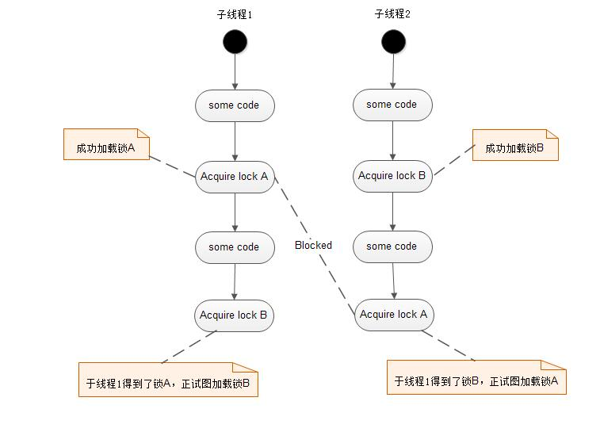

## what is deadlock

死锁(deadlocks): 是指两个或两个以上的进程(线程)在执行过程中，因争夺资源而造成的一种互相等待的现象，若无外力作用，它们都将无法推进下去。此时称系统处于死锁状态或系统产生了死锁，这些永远在互相等待的进程(线程)称为死锁进程(线程)。 由于资源占用是互斥的，当某个进程提出申请资源后，使得有关进程(线程)在无外力协助下，永远分配不到必需的资源而无法继续运行，这就产生了一种特殊现象死锁。

一种交叉持锁死锁的情形，此时执行程序中两个或多个线程发生永久堵塞(等待)，每个线程都在等待被其它线程占用并堵塞了的资源。例如，如果线程 1 锁住了记录 A 并等待记录 B，而线程 2 锁住了记录 B 并等待记录 A，这样两个线程就发生了死锁现象。在计算机系统中 , 如果系统的资源分配策略不当，更常见的可能是程序员写的程序有错误等，则会导致进程因竞争资源不当而产生死锁的现象。

## 产生死锁的四个必要条件

* 互斥条件：一个资源每次只能被一个进程(线程)使用
* 请求与保持条件：一个进程(线程)因请求资源而阻塞时，对已获得的资源保持不放
* 不剥夺条件：此进程(线程)已获得的资源，在末使用完之前，不能强行剥夺
* 循环等待条件：多个进程(线程)之间形成一种头尾相接的循环等待资源关系

## 死锁示例图

进程在执行一些代码之后，子线程1获得了锁A，正试图获得锁B；子线程2此时获得锁B，正试图获得锁A，这样子线程1和子线程2将没办法同时获得锁A和锁B，因为它们各自被对方占有，永远不会释放，从而发生死锁现象。
