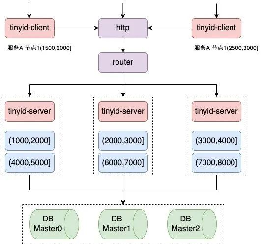

## 应用场景

业务开发中，很多场景需要用到唯一 ID 来标识时，单机时唯一 ID 容易维护，但在集群情况下，唯一 ID 必须满足以下特性

* 全局唯一：必须保证生成的 ID 是全局性唯一的，这是分布式 ID 的基本要求
* 有序性：生成的 ID 需要按照某种规则有序，便于数据库的写入和排序操作
* 可用性：需要保证高并发下的可用性。除了对 ID 号码自身的要求，业务还对 ID 生成系统的可用性要求极高
* 自主性：分布式环境下不依赖中心认证即可自行生成 ID
* 安全性：不暴露系统和业务的信息。在一些业务场景下，会需要 ID 无规则或者不规则

## 技术方案

### UUID

### 数据库自增 ID

### Redis 生成 ID

### 数据库号段模式

号段模式是当下分布式 ID 生成器的主流实现方式之一，号段模式可以理解成从数据库批量获取 ID，然后将 ID 缓存在本地，以此来提高业务获取 ID 的效率。例如，每次从数据库获取 ID 时，获取一个号段，如(1,1000]，这个范围表示 1000 个 ID，业务应用在请求获取 ID 时，只需要在本地从 1 开始自增并返回，而不用每次去请求数据库，一直到本地自增到 1000 时，才去数据库重新获取新的号段，后续流程循环往复。

#### 滴滴 Tinyid 方案

##### 系统架构



##### 环境搭建

ubuntu 20.04

```shell
git clone https://github.com/didi/tinyid.git
apt install maven
apt install default-jdk
apt install mysql
cd tinyid/tinyid-server/ && create table with db.sql (mysql)
```
修改配置文件
vim tinyid-server/src/main/resources/offline/application.properties
```shell
server.port=9999
server.context-path=/tinyid

batch.size.max=1000

datasource.tinyid.names=primary
#datasource.tinyid.names=primary,secondary
datasource.tinyid.type=org.apache.tomcat.jdbc.pool.DataSource

datasource.tinyid.primary.driver-class-name=com.mysql.jdbc.Driver
# 由于 MySQL 5.5.45+, 5.6.26+ and 5.7.6+ 默认开启 SSL，未配置证书情况下需要设置useSSL=false
datasource.tinyid.primary.url=jdbc:mysql://localhost:3306/POC?autoReconnect=true&useUnicode=true&characterEncoding=UTF-8&useSSL=false
datasource.tinyid.primary.username=root
datasource.tinyid.primary.password=1996xy21
#datasource.tinyid.primary.testOnBorrow=false
#datasource.tinyid.primary.maxActive=10

#datasource.tinyid.secondary.driver-class-name=com.mysql.jdbc.Driver
#datasource.tinyid.secondary.url=jdbc:mysql://localhost:3306/db2?autoReconnect=true&useUnicode=true&characterEncoding=UTF-8
#datasource.tinyid.secondary.username=root
#datasource.tinyid.secondary.password=123456
#datasource.tinyid.secondary.testOnBorrow=false
#datasource.tinyid.secondary.maxActive=10

```
编译

```shell
cd tinyid-server/
sh build.sh offline
```

启动服务

`java -jar output/tinyid-server-0.1.0-SNAPSHOT.jar`

测试

```shell
nextId:
curl 'http://localhost:9999/tinyid/id/nextId?bizType=test&token=0f673adf80504e2eaa552f5d791b644c'
response:{"data":[2],"code":200,"message":""}

nextId Simple:
curl 'http://localhost:9999/tinyid/id/nextIdSimple?bizType=test&token=0f673adf80504e2eaa552f5d791b644c'
response: 3

with batchSize:
curl 'http://localhost:9999/tinyid/id/nextIdSimple?bizType=test&token=0f673adf80504e2eaa552f5d791b644c&batchSize=10'
response: 4,5,6,7,8,9,10,11,12,13

Get nextId like 1,3,5,7,9...
bizType=test_odd : delta is 2 and remainder is 1
curl 'http://localhost:9999/tinyid/id/nextIdSimple?bizType=test_odd&batchSize=10&token=0f673adf80504e2eaa552f5d791b644c'
response: 3,5,7,9,11,13,15,17,19,21
```

在 java 服务每次重启时，起始 ID 都会增加配置的步进数值，保证了 ID 的唯一性