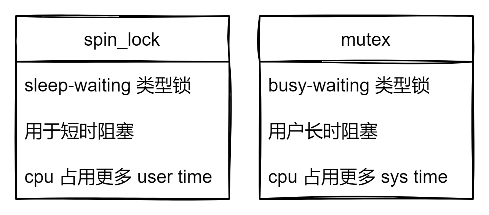

# 前言

当共享资源被多个线程访问时，为了保证资源的正确访问，通常使用锁机制来保证数据的正确访问，在进程上下文访问
时，可以使用 mutex 锁机制，但当数据被中断上下文时，导致睡眠的 lock 就不能被使用了，此时可以使用 spinlock.

# spinlock vs mutex

* spinlock 是一种死等的锁机制，当访问资源冲突时，尝试获取锁的线程会进入忙等待，导致 cpu 占用提高。而 mutex 则会挂起当前线程，调度其余进程执行。
* 只允许一个 thread 进入，一次只能有一个 thread 获取锁并进入临界区。
* 执行时间短, linux 内核中 spinlock 操作需要非常少的指令，应用于代码不是非常复杂的临界区。
* 可以在中断上下文中执行，因为线程不睡眠。

#总结

* mutex 适合对锁操作非常频繁的场景，有更好的适应性。对比 spinlock 会花费更多的开销(主要是上下文切换)，但是适合实际开发过程的复杂应用场景，保证一定性能的基础上提供更大的灵活性。
* spinlock 的 lock/unlock 性能更好(花费更少的 cpu 指令)，但是只适合应用于临界区运行时间很短的场景。而在实际软件开发中，除非程序员对自己的程序的锁操作行为非常的了解，否则使用spin lock不是一个好主意(通常一个多线程程序中对锁的操作有数以万次，如果失败的锁操作(contended lock requests)过多的话就会浪费很多的时间进行空等待)
* 更保险的方法或许是先（保守的）使用 Mutex，然后如果对性能还有进一步的需求，可以尝试使用spin lock进行调优。毕竟我们的程序不像Linux kernel那样对性能需求那么高(Linux Kernel最常用的锁操作是spin lock和rw lock)。

# 参考资料

[Linux内核同步机制之（四）：spin lock](http://www.wowotech.net/kernel_synchronization/spinlock.html)

[What is the Difference Between Spinlock and Mutex](https://pediaa.com/what-is-the-difference-between-spinlock-and-mutex/)

[Pthreads并行编程之spin lock与mutex性能对比分析](https://hottaro.com/index.php?mid=CCPP&document_srl=8379)

