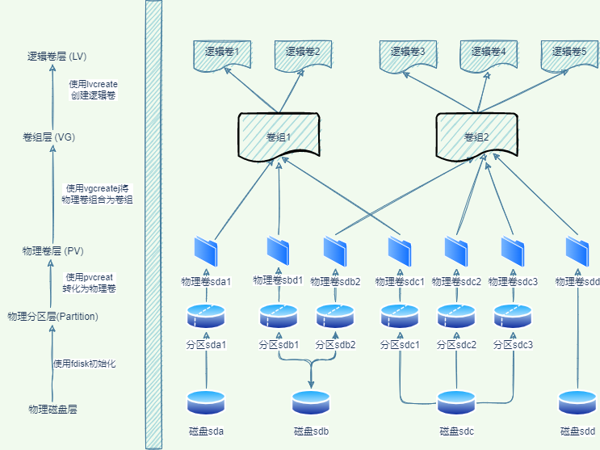

# 工具使用介绍

## systemctl

Systemctl 是一个 systemd 工具，主要负责控制 systemd 系统和服务管理器。

Systemd 是一个系统管理守护进程、工具和库的集合，用于取代 System V 初始进程。Systemd 的功能是用于集中管理和配置类 UNIX 系统

[systemctl 命令完全指南](https://linux.cn/article-5926-1.html)

[systemctl命令介绍和使用](https://segmentfault.com/a/1190000023029058)

### 配置自定义服务

```sh
cd /usr/lib/systemd/system/ 目录中创建自定义的 service 文件如下

redis-server.service 

[Unit]
Description=Advanced key-value store
After=network.target
Documentation=http://redis.io/documentation, man:redis-server(1)

[Service]
Type=forking
ExecStart=/opt/dev_src/redis-6.2.6/src/redis-server /etc/redis/redis.conf
ExecStop=/opt/dev_src/redis-6.2.6/src/redis-cli shutdown
TimeoutStopSec=0
Restart=always
#User=redis
#Group=redis

[Install]
WantedBy=multi-user.target
#Alias=redis.service
```

#### 常用命令

```sh
systemctl list-units --type=service 列出所有的 service
systemctl list-units --type=service --state=active 列出所有为 active 状态的服务
systemctl list-units --type=service --state running,failed 列出所有正在运行或失败的服务
systemctl start/stop/restart/reload service 对一个服务进行启动、停止、重启、重新加载操作
sytemctl daemon-reload 重载所有修改过的配置文件
```

## snap

一个全新的软件包管理方式，类似与容器拥有一个程序的所有文件和库，各个应用程序之间完全独立。**解决了应用程序间的依赖，使程序更容易管理，但会导致占用磁盘空间变大。**

### 安装方法

```sh
apt install snap
apt install snapcraft 提供将程序打包成 snap
```

### 常用命令

```sh
snap list 列出已经安装的 snap 包
snap find ... 搜索要安装的 snap 包
snap install ... 安装对应的 snap 包
snap refresh ... 更新一个 snap 包，不指定名称则更新所有
snap revert ... 还原一个 snap 包
snap remove ... 删除对应 snap 包
snap change 查看安装状态
```

## dpkg

Debian，以及基于 Debian 的系统，如 Ubuntu 等，所使用的包格式为 deb。以下为操作 deb 包的常用 Dpkg 指令表

```sh
dpkg -i package.deb	安装包
dpkg -r package	删除包
dpkg -P package	删除包（包括配置文件）
dpkg -L package	列出与该包关联的文件
dpkg -l package	显示该包的版本
dpkg --unpack package.deb	解开 deb 包的内容
dpkg -S keyword	搜索所属的包内容
dpkg -l	列出当前已安装的包
dpkg -c package.deb	列出 deb 包的内容
dpkg --configure package	配置包
```

## APT

APT 全称为“Advanced Package Tool”即高级软件包工具,和命令 apt 不是一个东西；这是现今最成熟的软件包管理系统，它可以自动检测软件依赖问题，下载和安装所有文件；

> apt = apt-get、apt-cache 和 apt-config 中最常用命令选项的集合。

### apt 和 apt-get 的区别

通过 **apt** 命令，用户可以在同一地方集中得到所有必要的工具，**apt** 的主要目的是提供一种以「让终端用户满意」的方式来处理 Linux 软件包的有效方式。

**apt** 具有更精减但足够的命令选项，而且参数选项的组织方式更为有效。除此之外，它默认启用的几个特性对最终用户也非常有帮助。例如，可以在使用 **apt** 命令安装或删除程序时看到进度条。

**apt** 还会在更新存储库数据库时提示用户可升级的软件包个数。

虽然 **apt** 与 **apt-get** 有一些类似的命令选项，但它并不能完全向下兼容 **apt-get** 命令。也就是说，可以用 **apt** 替换部分 **apt-get** 系列命令，但不是全部。

| apt 命令                           | 取代的命令                         | 命令的功能                     |
| ------------------------------------ | ------------------------------------ | -------------------------------- |
| apt install                        | apt-get install                    | 安装软件包                     |
| apt remove                         | apt-get remove                     | 移除软件包                     |
| apt purge                          | apt-get purge                      | 移除软件包及配置文件           |
| apt update                         | apt-get update                     | 刷新存储库索引                 |
| apt upgrade                        | apt-get upgrade                    | 升级所有可升级的软件包         |
| apt autoremove                     | apt-get autoremove                 | 自动删除不需要的包             |
| apt download                       | apt—get download                  | 下载对应的软件包               |
| apt full-upgrade                   | apt-get dist-upgrade               | 在升级软件包时自动处理依赖关系 |
| apt install --reinstall            | apt-get install --reinstall        | 重新安装软件                   |
| apt --install-suggests install     | apt-get --install-suggests install | 同时安装建议的安装包           |
| apt-get --install-suggests install | apt-get --install-suggests install | 不安装建议的安装包             |
| apt search                         | apt-cache search                   | 搜索应用程序                   |
| apt show                           | apt-cache show                     | 显示装细节                     |

| 新的apt命令      | 命令的功能                           |
| ------------------ | -------------------------------------- |
| apt list         | 列出包含条件的包（已安装，可升级等） |
| apt edit-sources | 编辑源列表                           |

## nala

nala 是 libapt-pkg 的前端，通过删除一些冗余消息、改进包格式以及使用颜色来说明在安装、删除或升级过程中包发生的情况来简化 apt 的使用.

主要优点：

* 并行下载
* 自动选择最快的镜像
* 软件包的管理历史

### 安装方法

```sh
git clone https://gitlab.com/volian/nala
cd nala
python3 ./setup.py build
sudo python3 ./setup.py install
```

或

```sh
echo "deb [arch=amd64,arm64,armhf] http://deb.volian.org/volian/ scar main" | sudo tee /etc/apt/sources.list.d/volian-archive-scar-unstable.list
wget -qO - https://deb.volian.org/volian/scar.key | sudo tee /etc/apt/trusted.gpg.d/volian-archive-scar-unstable.gpg > /dev/null
sudo apt update && sudo apt install nala
```

### 用法

```sh
usage: nala [--options] <command>

commands:

install            install packages
remove             remove packages
purge              purge packages
update             update package list and upgrade the system
upgrade            alias for update
fetch              fetches fast mirrors to speed up downloads
show               show package details
history            show transaction history
clean              clears out the local repository of retrieved package files

optional arguments:
-h, --help           show this help message and exit
-y, --assume-yes     assume 'yes' to all prompts and run non-interactively
-d, --download-only  package files are only retrieved, not unpacked or installed
-v, --verbose        logs extra information for debugging
--no-update          skips updating the package list
--no-autoremove      stops nala from autoremoving packages
--remove-essential   allows the removal of essential packages
--raw-dpkg           skips all formatting and you get raw dpkg output
--update             updates the package list
--debug              logs extra information for debugging
--version            show program's version number and exit
--license            reads the licenses of software compiled in and then reads the GPLv3
```

# 软件工具安装

## 编译开发工具安装

**一键安装**

`apt install build-essential cmake gdb libboost-all-dev libsystemd-dev libssl-dev pkg-config tcl tcl-tls net-tools`

## Linux 系统监控工具选型

[比 top 更好用的七个 linux 重要系统状态监控工具](https://itsfoss.com/linux-system-monitoring-tools/)

**推荐 htop、glances、bashtop(bpytop)**

### bashtop

一款针对 Linux/OSX/FreeBSD 的基于终端的资源监控使用程序, 开发者写了三个版本，bahstop(基于 shell 编写)，bpytop(基于 python 编写)， btop(基于 C++ 编写)

安装方法：

* snap

```sh
snap install bashtop
```

* APT软件包管理器

```sh
sudo add-apt-repository ppa:bashtop-monitor/bashtop
'add-apt-repository: command not found
apt install software-properties-common'
sudo apt update
sudo apt install bashtop
```

# 网络配置

## 查看网络配置

```sh
ip a
ip addr
```

## 设置网络地址

ubuntu 20.04 使用 **netplan** 作为默认网络配置

**查看 netplan 配置文件**

`ls /etc/netplan`

**备份默认配置文件**

`cp /etc/netplan/00-installer-config.yaml /etc/netplan/00-installer-config.yaml.bak`

**编辑配置文件**

`nano /etc/netplan/00-installer-config.yaml`

### 静态地址

```yaml
network:
  ethernets:
    ens33:
      dhcp4: no
      addresses:
      - 192.168.0.111/24
      gateway4: 192.168.0.1
      nameservers:
        addresses: [114.114.114.114, 8.8.8.8]
  version: 2
```

### 动态地址

```yaml
network:
  ethernets:
    ens33:
      dhcp4: yes
      addresses: []
  version: 2
```

*修改时不能使用制表符*

**应用配置**

```sh
netplan try
netplan apply
```

## 主机名配置

### 查看主机名

```sh
hostnamectrl
hostname
```

### 修改主机名

`hostnamectl set-hostname ubuntu.server`
或

```sh
vim /etc/hostname
vim /etc/hosts
```

# LVM 磁盘管理

## 术语说明

* 逻辑卷组管理 (Logic Volume Manager)
* 物理卷 (Physical Volume, PV): 物理磁盘分区，如果使用 LVM 管理，需要使用 fdisk 将其 ID 改为 LVM 可以识别的值，即 8e.
* 卷组 (Volume Group,VG): PV 的集合
* 逻辑卷 (Logic Volume,LV): VG 中分出的逻辑磁盘

架构如下：



## LVM 管理的优点

* 可以使用大容量磁盘，将多块磁盘聚合到一个卷组上，可以分配大容量逻辑卷，以便挂载。
* 动态调整磁盘大小，使磁盘空间得到合理利用。

## 使用教程

### 创建物理卷 (PV)

创建物理卷可以使用磁盘直接创建也可以使用磁盘分区创建

相关命令

```sh
# pvcreate 创建物理卷
pvcreate /dev/sda

# pvdisplay、pvscan、pvs 查看物理卷
pvdisplay
pvscan
pvs
```

#### 磁盘创建物理卷

样例：

```sh
# 使用fdisk -l确认磁盘，可以看到/dev/sdb未做分区处理
[root@masterdb ~]# fdisk -l /dev/sdb

Disk /dev/sdb: 2147 MB, 2147483648 bytes, 4194304 sectors
Units = sectors of 1 * 512 = 512 bytes
Sector size (logical/physical): 512 bytes / 512 bytes
I/O size (minimum/optimal): 512 bytes / 512 bytes

# 使用pvcreate将sdb磁盘创建为物理卷
[root@masterdb ~]# pvcreate /dev/sdb
  Physical volume "/dev/sdb" successfully created.

# 使用pvdisplay确认物理卷信息
[root@masterdb ~]# pvdisplay 
  --- Physical volume ---
  PV Name               /dev/sda3
  VG Name               centos
  PV Size               <68.73 GiB / not usable 4.00 MiB
  Allocatable           yes (but full)
  PE Size               4.00 MiB
  Total PE              17593
  Free PE               0
  Allocated PE          17593
  PV UUID               FRxq7G-1XWu-dPeW-wEwO-322y-M9XR-0ExebA
   
  "/dev/sdb" is a new physical volume of "2.00 GiB"
  --- NEW Physical volume ---
  PV Name               /dev/sdb
  VG Name               
  PV Size               2.00 GiB
  Allocatable           NO
  PE Size               0   
  Total PE              0
  Free PE               0
  Allocated PE          0
  PV UUID               nsL75f-o3fD-apyz-SSY0-miUi-4RYf-zVLIT6
   # 也可以使用pvs确认物理卷信息,不过能够看到的信息比pvdisplay少
[root@masterdb ~]# pvs 
  PV         VG     Fmt  Attr PSize  PFree
  /dev/sda3  centos lvm2 a--  68.72g    0 
  /dev/sdb          lvm2 ---   2.00g 2.00g
```

#### 磁盘分区创建物理卷

磁盘分区后，需要将磁盘的 ID 改为 8e

样例：

```sh
[root@masterdb ~]# fdisk /dev/sdc 
 Welcome to fdisk (util-linux 2.23.2).

Changes will remain in memory only, until you decide to write them.
 Be careful before using the write command.


 Command (m for help): t     #t可以修改分区代码
 Partition number (1,2, default 2): 1            #选择1分区进行修改
 Hex code (type L to list all codes): L          #如果不知道类型，可以用”L”列出可以选择的修改代码

  0  Empty           24  NEC DOS         81  Minix / old Lin bf  Solaris        
  1  FAT12           27  Hidden NTFS Win 82  Linux swap / So c1  DRDOS/sec (FAT-
  2  XENIX root      39  Plan 9          83  Linux           c4  DRDOS/sec (FAT-
  3  XENIX usr       3c  PartitionMagic  84  OS/2 hidden C:  c6  DRDOS/sec (FAT-
  4  FAT16 <32M      40  Venix 80286     85  Linux extended  c7  Syrinx         
  5  Extended        41  PPC PReP Boot   86  NTFS volume set da  Non-FS data    
  6  FAT16           42  SFS             87  NTFS volume set db  CP/M / CTOS / .
  7  HPFS/NTFS/exFAT 4d  QNX4.x          88  Linux plaintext de  Dell Utility   
  8  AIX             4e  QNX4.x 2nd part 8e  Linux LVM       df  BootIt         
  9  AIX bootable    4f  QNX4.x 3rd part 93  Amoeba          e1  DOS access     
  a  OS/2 Boot Manag 50  OnTrack DM      94  Amoeba BBT      e3  DOS R/O        
  b  W95 FAT32       51  OnTrack DM6 Aux 9f  BSD/OS          e4  SpeedStor      
  c  W95 FAT32 (LBA) 52  CP/M            a0  IBM Thinkpad hi eb  BeOS fs        
  e  W95 FAT16 (LBA) 53  OnTrack DM6 Aux a5  FreeBSD         ee  GPT            
  f  W95 Ext'd (LBA) 54  OnTrackDM6      a6  OpenBSD         ef  EFI (FAT-12/16/
 10  OPUS            55  EZ-Drive        a7  NeXTSTEP        f0  Linux/PA-RISC b
 11  Hidden FAT12    56  Golden Bow      a8  Darwin UFS      f1  SpeedStor      
 12  Compaq diagnost 5c  Priam Edisk     a9  NetBSD          f4  SpeedStor      
 14  Hidden FAT16 <3 61  SpeedStor       ab  Darwin boot     f2  DOS secondary  
 16  Hidden FAT16    63  GNU HURD or Sys af  HFS / HFS+      fb  VMware VMFS    
 17  Hidden HPFS/NTF 64  Novell Netware  b7  BSDI fs         fc  VMware VMKCORE 
 18  AST SmartSleep  65  Novell Netware  b8  BSDI swap       fd  Linux raid auto
 1b  Hidden W95 FAT3 70  DiskSecure Mult bb  Boot Wizard hid fe  LANstep        
 1c  Hidden W95 FAT3 75  PC/IX           be  Solaris boot    ff  BBT            
 1e  Hidden W95 FAT1 80  Old Minix      
 Hex code (type L to list all codes): 8e         #选择8e
 Changed type of partition 'Linux' to 'Linux LVM'

Command (m for help): w               # 保存
 The partition table has been altered!

Calling ioctl() to re-read partition table.
 Syncing disks.
 [root@masterdb ~]#
```

### 创建扩容卷组

相关命令

```sh
# vgcreate 创建卷组
vgcreate [VG_NAME] [device1] [device2] ...

# vgdisplay、vgsan、vgs 查看卷组
vgdisplay
vgsan
vgs
```

样例：

```sh
# 使用vgcreate创建卷组VG_TEST,包含物理卷：/dev/sdb和/dev/sdc1
[root@masterdb ~]# vgcreate VG_TEST /dev/sdb /dev/sdc1
  Volume group "VG_TEST" successfully created
# 查看方法一：使用vgdisplay查看卷组信息[root@masterdb ~]# vgdisplay
  --- Volume group ---
  VG Name               VG_TEST
  System ID             
  Format                lvm2
  Metadata Areas        2
  Metadata Sequence No  1
  VG Access             read/write
  VG Status             resizable
  MAX LV                0
  Cur LV                0
  Open LV               0
  Max PV                0
  Cur PV                2
  Act PV                2
  VG Size               2.99 GiB
  PE Size               4.00 MiB
  Total PE              766
  Alloc PE / Size       0 / 0   
  Free  PE / Size       766 / 2.99 GiB
  VG UUID               DmY2Nz-ietc-2Y8Y-7A1b-1cpT-qEeV-XrgURn
...  
   
# 查看方法二：使用vgscan查看卷组信息
[root@masterdb ~]# vgscan
  Reading volume groups from cache.
  Found volume group "VG_TEST" using metadata type lvm2
  Found volume group "centos" using metadata type lvm2

# 查看方法三：使用vgs查看卷组信息
[root@masterdb ~]# vgs 
  VG      #PV #LV #SN Attr   VSize  VFree
  VG_TEST   2   0   0 wz--n-  2.99g 2.99g
  centos    1   4   0 wz--n- 68.72g    0
```

#### 扩容卷组

相关命令：

```sh
vgextend [VG_NAME] [device1] [device2] ...
```

### 创建、扩容、逻辑卷

相关命令：

```sh
# lvcreate 创建逻辑卷
lvcreate -L [SIZE] -n [LV_NAME] [VG_NAME]

# lvdisplay、lvscan、lvs 查看逻辑卷
lvdisplay
lvscan
lvs
```

#### 创建逻辑卷

```sh
# 使用lvcreate创建逻辑卷lv_test
[root@masterdb ~]# lvcreate -L 1g -n lv_test VG_TEST
  Logical volume "lv_test" created.

# 查看方法一：使用lvdisplay查看逻辑卷[root@masterdb ~]# lvdisplay 
  --- Logical volume ---
  LV Path                /dev/VG_TEST/lv_test
  LV Name                lv_test
  VG Name                VG_TEST
  LV UUID                RqWMOG-wCJJ-deu4-dIgv-c5hI-Bsqa-FHgh4E
  LV Write Access        read/write
  LV Creation host, time masterdb, 2020-05-13 22:42:45 +0800
  LV Status              available
  # open                 0
  LV Size                1.00 GiB
  Current LE             256
  Segments               1
  Allocation             inherit
  Read ahead sectors     auto
  - currently set to     8192
  Block device           253:4
...
   
# 查看方法二：使用lvscan查看逻辑卷  
[root@masterdb ~]# lvscan 
  ACTIVE            '/dev/VG_TEST/lv_test' [1.00 GiB] inherit
  ACTIVE            '/dev/centos/mysql' [<45.00 GiB] inherit
  ACTIVE            '/dev/centos/swap' [<3.73 GiB] inherit
  ACTIVE            '/dev/centos/home' [10.00 GiB] inherit
  ACTIVE            '/dev/centos/root' [10.00 GiB] inherit
  
# 查看方法三：使用lvs查看逻辑卷  
[root@masterdb ~]# lvs 
  LV      VG      Attr       LSize   Pool Origin Data%  Meta%  Move Log Cpy%Sync Convert
  lv_test VG_TEST -wi-a-----   1.00g                                                    
  home    centos  -wi-ao----  10.00g                                                    
  mysql   centos  -wi-ao---- <45.00g                                                    
  root    centos  -wi-ao----  10.00g                                                    
  swap    centos  -wi-ao----  <3.73g
```

创建完 lv 后， 格式化挂载即可

```sh
# 创建文件系统[root@masterdb ~]# mkfs.ext3 /dev/VG_TEST/lv_test 
mke2fs 1.42.9 (28-Dec-2013)
Filesystem label=
 OS type: Linux
Block size=4096 (log=2)
Fragment size=4096 (log=2)
 Stride=0 blocks, Stripe width=0 blocks
 65536 inodes, 262144 blocks
 13107 blocks (5.00%) reserved for the super user
 First data block=0
 Maximum filesystem blocks=268435456
 8 block groups
 32768 blocks per group, 32768 fragments per group
 8192 inodes per group
 Superblock backups stored on blocks: 
     32768, 98304, 163840, 229376

Allocating group tables: done                            
 Writing inode tables: done                            
 Creating journal (8192 blocks): done
 Writing superblocks and filesystem accounting information: done

# 创建挂载点[root@masterdb ~]# mkdir /test 
# 挂载文件系统
[root@masterdb ~]# mount /dev/VG_TEST/lv_test /test
# 确认结果
[root@masterdb ~]# df –h 
 Filesystem                   Size  Used Avail Use% Mounted on
 /dev/mapper/centos-root       10G  4.1G  5.9G  42% /
 ...
 /dev/mapper/VG_TEST-lv_test  976M  1.3M  924M   1% /test
```

#### 扩容逻辑卷

相关命令：

```sh
# lvextend 扩容 lv，+SIZE 代表增加的空间
lvextend -L +[SIZE] [lv_device]

# resize2fs 调整文件系统的大小
resize2fs [lv_device]
```

样例：

```sh
# 对lv进行扩容，增加500M空间
[root@masterdb ~]# lvextend -L +500M /dev/VG_TEST/lv_test 
  Size of logical volume VG_TEST/lv_test changed from 1.00 GiB (256 extents) to <1.49 GiB (381 extents).
  Logical volume VG_TEST/lv_test successfully resized.

# 使用resize2fs调整文件系统的大小[root@masterdb ~]# resize2fs /dev/VG_TEST/lv_test 
resize2fs 1.42.9 (28-Dec-2013)
Filesystem at /dev/VG_TEST/lv_test is mounted on /test; on-line resizing required
old_desc_blocks = 1, new_desc_blocks = 1
The filesystem on /dev/VG_TEST/lv_test is now 390144 blocks long.

xfs文件系统扩容
xfs_growfs /dev/vg001/lv001 刷新信息，完成扩展。
df -hT 查看挂载信息以及容量，确认扩展成功
```

#### 缩容逻辑卷

相关命令:

```sh
# lvreduce 减小分区大小到 SIZE
lvreduce -L [SIZE] [lv_device]

eg:
ext4 文件系统
umount /dev/vg001/lv001 卸载设备
e2fsck -f /dev/vg001/lv001 检查文件系统完整性
resize2fs /dev/vg001/lv001 35G 刷新信息到需要缩小的空间
lvreduce -L 35G /dev/vg001/lv001 缩小逻辑卷
mount -a 重新挂载
```

xfs 文件系统大小调整：

```sh
# 备份数据 
xfsdump -f [/tmp/opt.dump] [/opt]

# 卸载分区
umount /test

# 减小分区大小
lvreduce -L 30G /dev/mapper/opt

# 使用 xfs 文件系统格式化分区
mkfs.xfs -f /opt

# 重新安装分区
mount /dev/mapper/opt /opt

# 恢复数据
xfsrestore -f /tmp/opt.dump /opt
```

#### 设置自动挂载

```sh
# lsblk 查看全局块设备布局

root@ubuntu:~# lsblk
NAME                      MAJ:MIN RM   SIZE RO TYPE MOUNTPOINT
loop0                       7:0    0  67.4M  1 loop /snap/powershell/200
sda                         8:0    0   120G  0 disk
├─sda1                      8:1    0     1M  0 part
├─sda2                      8:2    0   1.5G  0 part /boot
└─sda3                      8:3    0 118.5G  0 part
  ├─ubuntu--vg-ubuntu--lv 253:0    0  59.3G  0 lvm  /
  └─ubuntu--vg-opt--lv    253:1    0    59G  0 lvm  /opt
sr0                        11:0    1   1.2G  0 rom

# blkid 或者设备相关信息

root@ubuntu:~# blkid
/dev/sr0: UUID="2022-02-23-09-27-00-00" LABEL="Ubuntu-Server 20.04.4 LTS amd64" TYPE="iso9660" PTUUID="492bdcc4" PTTYPE="dos"
/dev/sda2: UUID="9445ef1c-6249-425f-89a6-38cf25acca9e" TYPE="ext4" PARTUUID="deaf7f11-f433-406e-8eb0-80074769829c"
/dev/sda3: UUID="qp2Wau-DcL5-slT3-KH9R-KMlG-71ez-PhH0xi" TYPE="LVM2_member" PARTUUID="616f30e5-8f5e-48d3-9541-cb9feef9c198"
/dev/mapper/ubuntu--vg-ubuntu--lv: UUID="14f22172-d6f2-41e9-a17c-46c738a6acfa" TYPE="ext4"
/dev/mapper/ubuntu--vg-opt--lv: UUID="8dc14374-37fc-4e1e-83c4-5d2020cb020e" TYPE="ext4"
/dev/loop0: TYPE="squashfs"
/dev/sda1: PARTUUID="ee8b5636-2b50-4c1d-ae33-0887bb5705a2"
```

编辑 /etc/fstab 文件系统信息

```sh
# <file system> <mount point>   <type>  <options>       <dump>  <pass>
# / was on /dev/ubuntu-vg/ubuntu-lv during curtin installation
/dev/disk/by-id/dm-uuid-LVM-q2JDRi66CdfDhvRF2N6xp14H7IfdxalwQfsag6us1M8KvxzvkUy3BjblSeHtqkyn / ext4 defaults 0 1
#/opt was on /dev/ubuntu-vg/opt-lv using as dev
/dev/mapper/ubuntu--vg-opt--lv /opt ext4 defaults  0 1
# /boot was on /dev/sda2 during curtin installation
/dev/disk/by-uuid/9445ef1c-6249-425f-89a6-38cf25acca9e /boot ext4 defaults 0 1
/swap.img       none    swap    sw      0       0
```

文件字段描述

| key         | description                                              |
|-------------|----------------------------------------------------------|
| file system | 将要挂载的特定块设备或远程文件系统                                        |
| mount point | 挂载点                                                      |
| type        | 挂载文件系统                                                   |
| options     | 文件系统相关联的挂载选项                                             |
| dump        | 针对ext2/3/4文件系统，是否要备份，防止因异常断电导致的数据丢失 此字段默认填0，不需要dump |
| pass        | 指定系统启动时通过fsck检查文件系统的顺序，根文件系统检查顺序为1，其他为2。默认为0表示不执行检查      |

