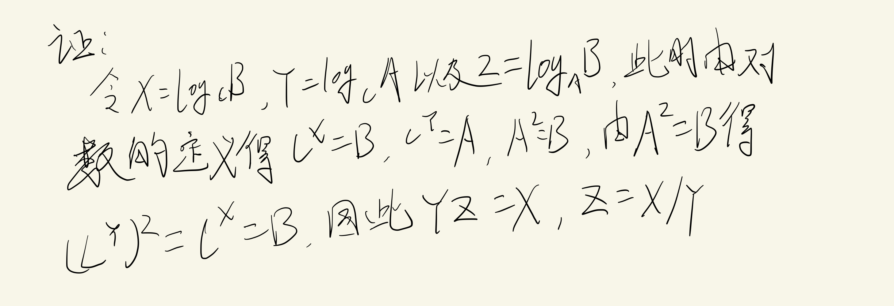
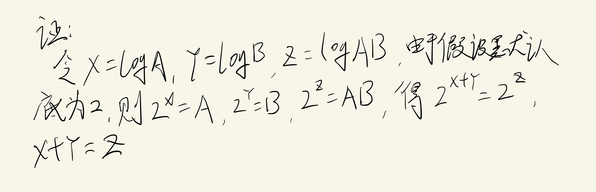

## 指数

$$
X^A X^B = X^{A+B}
$$

$$
\frac{X^{A}}{X^{B}}=X^{A-B}
$$

$$
\left(\boldsymbol{X}^{A}\right)^{B}=X^{A B}
$$

$$
X^{N}+X^{N}=2 X^{N} \neq X^{2 N}
$$

$$
2^{N}+2^{N}=2^{N+1}
$$

## 对数

计算机科学中，除非特备声明，所有的对数都是以2为底

定义：

$$
X^A = B, 当且仅当 \log_{X}{B} = A
$$

定理1

$$
\log _{A} B=\frac{\log _{C} B}{\log _{C} A} ; C>0
$$

定理2

$$
\log A B=\log A+\log B
$$

## 级数

$$
\sum_{i=0}^{N} 2^{i}=2^{N+1}-1 和 \sum_{i=0}^{N} A^{i}=\frac{A^{N+1}-1}{A-1}
$$
