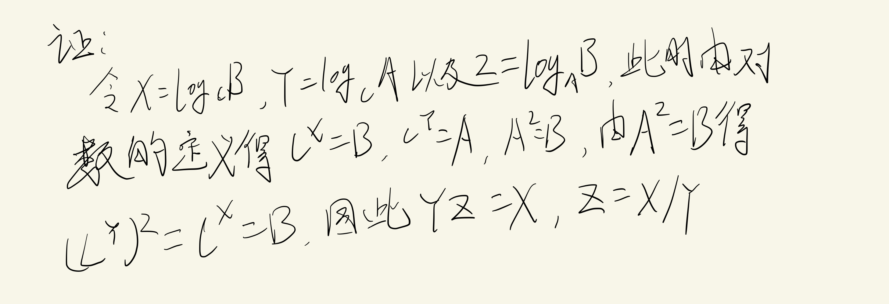
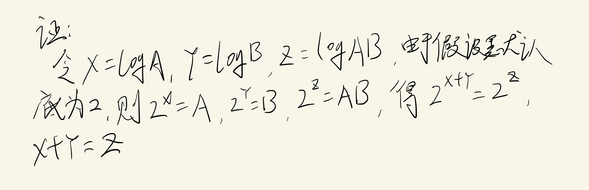

## 指数

$$
X^A X^B = X^{A+B}

$$

$$
\frac{X^{A}}{X^{B}}=X^{A-B}

$$

$$
\left(\boldsymbol{X}^{A}\right)^{B}=X^{A B}

$$

$$
X^{N}+X^{N}=2 X^{N} \neq X^{2 N}

$$

$$
2^{N}+2^{N}=2^{N+1}

$$

## 对数

计算机科学中，除非特备声明，所有的对数都是以2为底

定义：

$$
X^A = B, 当且仅当 \log_{X}{B} = A

$$

定理1

$$
\log _{A} B=\frac{\log _{C} B}{\log _{C} A} ; C>0

$$

定理2

$$
\log A B=\log A+\log B

$$

$$
\begin{array}{l}
\log A / B=\log A-\log B \\
\log \left(A^{B}\right)=B \log A \\
\log X<X(\text { 对所有的 } X>0 \text { 成立。) } \\
\log 1=0, \log 2=1, \log 1024=10, \log 1048576=20 \text { 。 }
\end{array}

$$

## 级数

$$
\sum_{i=0}^{N} 2^{i}=2^{N+1}-1 和 \sum_{i=0}^{N} A^{i}=\frac{A^{N+1}-1}{A-1}

$$

在第二个公式中, 如果  0<A<1 , 则

$$
\sum_{i=0}^{N} A^{i} \leqslant \frac{1}{1-A}

$$

当 N 接近无穷大时，和趋向于 1/(1-A)

我们可以用下面的方法推导关于

$$
\sum_{i=0}^{\infty} A^{i}(0<A<1)  的公式。令  S  表示和。此时

$$

$$
S=1+A+A^{2}+A^{3}+A^{4}+A^{5}+\cdots \cdots

$$

于是

$$
A S=A+A^{2}+A^{3}+A^{4}+A^{5}+\cdots \cdots

$$

如果我们将这两个等式相减(这种运算只能对收敛级数进行), 等号右边所有的项相消, 只留 下 1:
S- AS=1
这就是说

$$
S=\frac{1}{1-A}

$$

可以用相同的方法计算

$$
\sum_{i=1}^{\infty} i / 2^{i} , 它是一个经常出现的和。我们写成

$$

$$
S=\frac{1}{2}+\frac{2}{2^{2}}+\frac{3}{2^{3}}+\frac{4}{2^{4}}+\frac{5}{2^{5}}+\cdots \cdots

$$

用 2 乘之得到

$$
2 S=1+\frac{2}{2}+\frac{3}{2^{2}}+\frac{4}{2^{3}}+\frac{5}{2^{4}}+\frac{6}{2^{5}}+\cdots \cdots

$$

将这两个方程相减得到

$$
S=1+\frac{1}{2}+\frac{1}{2^{2}}+\frac{1}{2^{3}}+\frac{1}{2^{4}}+\frac{1}{2^{5}}+\cdots \cdots

$$

因此，S = 2

分析中另一种常用类型的级数是算术级数。任何这样的级数都可以通过基本公式计算其值。

$$
\sum_{i=1}^{N} i=\frac{N(N+1)}{2} \approx \frac{N^{2}}{2}

$$

$$
\begin{array}{c}
\sum_{i=1}^{N} i^{2}=\frac{N(N+1)(2 N+1)}{6} \approx \frac{N^{3}}{3} \\\\
\sum_{i=1}^{N} i^{k} \approx \frac{N^{k+1}}{|k+1|} \quad k \neq-1
\end{array}

$$

当  k=-1  时, 后一个的公式不成立。此时我们需要下面的公式, 这个公式在计算机科学 中的使用要远比在数学其他科目中使用得多。数  H_{N}  叫做调和数, 其和叫做调和和。下面近 似式中的误差趋向于

$$
\gamma \approx 0.57721566
 , 这个值称为欧拉常数(Euler's constant)。

$$

$$
H_{N}=\sum_{i=1}^{N} \frac{1}{i} \approx \log _{\mathrm{e}} N

$$

以下两个公式只不过是一般的代数运算。

$$
\begin{array}{l}
\sum_{i=1}^{N} f(N)=N f(N) \\\\
\sum_{i=n_{0}}^{N} f(i)=\sum_{i=1}^{N} f(i)-\sum_{i=1}^{n_{0}-1} f(i)
\end{array}

$$

## 模运算

如果  N  整除  A-B , 那么我们就说  A  与  B  模  N  同余 (congruent), 记为

$$
A \equiv B(\bmod N)_\  直观地看, 这意味着无论  A  还是  B  被  N  去除, 所得余数都是相同。\\ 于是,81 \equiv 61 \equiv 1(\bmod 10)_{\text {。 }}  如同等号的情形一样, 若  A \equiv B(\bmod N) , \\ 则  A+C \equiv B+C(\bmod N)  以及  A D \equiv B D(\bmod N)_{\text {。 }}

$$

### 归纳法证明

如果

$$
N \geqslant 1 , 则  \sum_{i=1}^{N} i^{2}=\frac{N(N+1)(2 N+1)}{6}

$$

证明: 用数学归纳法证明。对于基准情形, 容易看到，定理当  N=1  的时候成立。对于归纳假设。

$$
我们设定理对  1 \leqslant k \leqslant N  成立。我们将在该假设下证明定理对于  N+1  也是成立的。 我们有

$$

$$
\sum_{i=1}^{N+1} i^{2}=\sum_{i=1}^{N} i^{2}+(N+1)^{2}

$$

应用归纳假设我们得到

$$
\begin{aligned}
\sum_{i=1}^{N+1} i^{2} &=\frac{N(N+1)(2 N+1)}{6}+(N+1)^{2} \\
&=(N+1)\left[\frac{N(2 N+1)}{6}+(N+1)\right] \\
&=(N+1) \frac{2 V^{2}+7 N+6}{6} \\
&=\frac{(N+1)(N+2)(2 N+3)}{6}
\end{aligned}

$$

因此

$$
\sum_{i=1}^{N+1} i^{2}=\frac{(N+1)[(N+1)+1][2(N+1)+1]}{6}

$$

定理得证。

### 反证法证明

反证法证明是通过假设定理不成立，然后证明该假设导致某个已知的性质不成立.,从而 说明原假设是错误的。一个经典的例子是证明存在无穷多个素数。为了证明这个结论，我们 假设定理不成立。于是，存在某个最大的素数

$$
P_{k}  。令  P_{1}, P_{2}, \ldots, P_{k}  是依序排列的所有素 数并考虑

$$

$$
N=P_{1} P_{2} P_{3} \cdots P_{k}+1

$$

$$
显然，  N  是比  P_{k}  大的数，根据假设  N  不是素数。可是,  \\ P_{1}, P_{2}, \cdots, P_{k}

$$

都不能整除  N , 因为 除得的结果总有余数 1 。这就产生一个矛盾, 因为每一个整数或者是素数, 或者是素数的乘积。因此，P_{k} 是最大素数的原假设是不成立的，这意味着定理成立。
