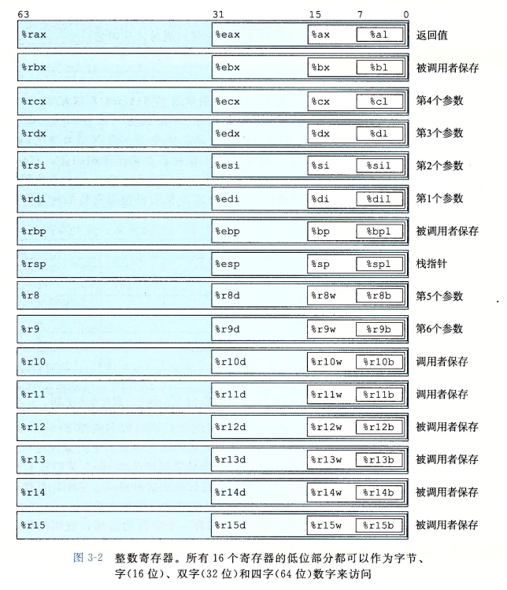

## preview
gcc 编译选项 omit-frame-pointer 主要是用于优化软件性能。对此 GCC 手册上给出解释为

```text
-fomit-frame-pointer
   Don't keep the frame pointer in a register for functions that don't need one.  This avoids the instructions to save, set up and restore frame pointers; it also makes an extra register
   available in many functions.  It also makes debugging impossible on some machines.

   On some machines, such as the VAX, this flag has no effect, because the standard calling sequence automatically handles the frame pointer and nothing is saved by pretending it doesn't
   exist.  The machine-description macro "FRAME_POINTER_REQUIRED" controls whether a target machine supports this flag.

   Starting with GCC version 4.6, the default setting (when not optimizing for size) for 32-bit GNU/Linux x86 and 32-bit Darwin x86 targets has been changed to -fomit-frame-pointer.  The
   default can be reverted to -fno-omit-frame-pointer by configuring GCC with the --enable-frame-pointer configure option.

   Enabled at levels -O, -O2, -O3, -Os.
   
   不保留函数不需要的帧指针在寄存器中。 这省去了保存、设置和恢复帧指针的产生的指令； 同事这样也使许多函数的额外寄存器可用。 并在某些机器上不能进行调试。
在某些机器上，例如VAX，此标志没有效果，因为标准调用序列自动处理帧指针，并且假装它不存在并不会保存任何内容。机器描述宏“FRAME_POINTER_REQUIRED”控制目标机器是否支持此标志。
从GCC 4.6版本开始，32位GNU/Linux x86和32位Darwin x86目标的默认设置（在不针对尺寸进行优化时）已更改为-fomit-frame-pointer。 默认设置可以通过使用--enable-frame-pointer配置选项重新配置GCC来恢复为-fno-omit-frame-pointer。
在-O、-O2、-O3、-Os级别启用
```

## explain
这里，引入了一个"frame pointer"的概念，什么是"stack frame pointer(SFP)"呢？

我们知道，backtrace是利用堆栈中的信息把函数调用关系层层遍历出来的，其中这里的堆栈信息就是SFP。
一般情况下，每一个函数都 包含一个堆栈边界指针，也就是说会存在一个栈底和栈顶指针。在X86下，假设堆栈由上往下发展，栈底大地址而栈顶小地址，那么，通常情况下，寄存器ESP 为栈顶指针，而EBP就为栈底指针。而EBP和ESP之间的空间就是这个函数的stack frame。
GCC在默认情况下会在每个函数的开始加入一些堆栈设置代码，而在函数退出的时候恢复原来的样子，SFP就是在这个时候设置的。还是看一下这个时候的汇编代码吧。

**环境**
X86-64+Ubuntu 22.04，gcc 11.3.0
```shell
> cat test.c

#include <stdio.h>
void test(const char* str)
{
        printf("test %s\n", str);
}
默认编译选项：
> gcc -c test.c -o with_SFP.o

反汇编后是这个样子：
> objdump -D with_SFP.o

❯ objdump -d with_SPF.o

with_SPF.o:     file format elf64-x86-64


Disassembly of section .text:

0000000000000000 <test>:
   0:   f3 0f 1e fa             endbr64
   4:   55                      push   %rbp
   5:   48 89 e5                mov    %rsp,%rbp
   8:   48 83 ec 10             sub    $0x10,%rsp
   c:   48 89 7d f8             mov    %rdi,-0x8(%rbp)
  10:   48 8b 45 f8             mov    -0x8(%rbp),%rax
  14:   48 89 c6                mov    %rax,%rsi
  17:   48 8d 05 00 00 00 00    lea    0x0(%rip),%rax        # 1e <test+0x1e>
  1e:   48 89 c7                mov    %rax,%rdi
  21:   b8 00 00 00 00          mov    $0x0,%eax
  26:   e8 00 00 00 00          call   2b <test+0x2b>
  2b:   90                      nop
  2c:   c9                      leave
  2d:   c3                      ret

```
可以看到函数ENTER时首先把上一层函数的RBP入栈，设置本函数的RBP，然后会根据临时变量的数量和对齐要求去设置RSP，也就产生了函数的stack frame。
我们再看看函数的返回："leave"指令相当于"mov %rbp,%rsp;pop %rbp",也就是ENTER是两条指令的恢复过程，所以，后面的"ret"指令和"call"指令对应。
这里backtrace就可以根据现有函数RBP指针得知上一个函数的RBP----栈底再往上保存着上一个函数的RBP和EIP，然后就可以得知函数调用的路径。
SFP是可以在编译时候优化掉的，用"-fomit-frame-pointer "选项
```shell
❯ gcc -fomit-frame-pointer -c test.c -o no_SPF.o
❯ objdump -d no_SPF.o

no_SPF.o:     file format elf64-x86-64


Disassembly of section .text:

0000000000000000 <test>:
   0:   f3 0f 1e fa             endbr64
   4:   48 83 ec 18             sub    $0x18,%rsp
   8:   48 89 7c 24 08          mov    %rdi,0x8(%rsp)
   d:   48 8b 44 24 08          mov    0x8(%rsp),%rax
  12:   48 89 c6                mov    %rax,%rsi
  15:   48 8d 05 00 00 00 00    lea    0x0(%rip),%rax        # 1c <test+0x1c>
  1c:   48 89 c7                mov    %rax,%rdi
  1f:   b8 00 00 00 00          mov    $0x0,%eax
  24:   e8 00 00 00 00          call   29 <test+0x29>
  29:   90                      nop
  2a:   48 83 c4 18             add    $0x18,%rsp
  2e:   c3                      ret

```

这里把RBP省掉了，RSP兼职了RBP的部分工作（索引临时变量）。
显而易见，代码难懂了， 代码执行长度缩短了，应该能引起效率的提升。 但是不能用backtrace调试了。

## extend



## refer
[-fomit-frame-pointer的作用](https://blog.csdn.net/blueOceanindream/article/details/6260695?spm=1001.2101.3001.6650.5&utm_medium=distribute.pc_relevant.none-task-blog-2%7Edefault%7EBlogCommendFromBaidu%7ERate-5-6260695-blog-8462414.pc_relevant_recovery_v2&depth_1-utm_source=distribute.pc_relevant.none-task-blog-2%7Edefault%7EBlogCommendFromBaidu%7ERate-5-6260695-blog-8462414.pc_relevant_recovery_v2&utm_relevant_index=6)
