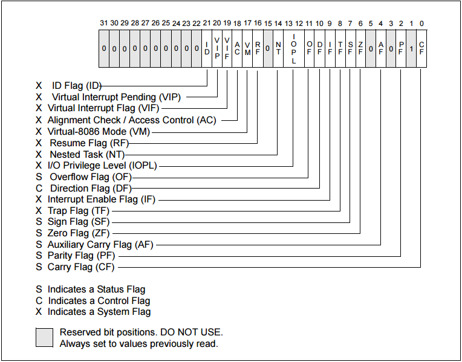

## 概述

移位操作指令：移位操作指令是一组经常使用的指令，属于汇编语言逻辑指令中的一部分，它包括移位指令（含算术移位指令、逻辑移位指令），循环移位指令（含带进位的循环移位指令），双精度移位指令三大类。其功能为将目的操作数的所有位按操作符规定的方式移动1位或按寄存器CL规定的次数（0~255）移动，结果送入目的地址。目的操作数是8位（或16位）的寄存器数据或存储器数据。

## 术语对照表

| 英文全称                         | 汇编指令  | 中文翻译                      | 说明                                                                           |
|------------------------------|-------|---------------------------|------------------------------------------------------------------------------|
| Shift Logical Left           | SHL   | 逻辑左移                      | 目标操作数整体向左移指定次数，最后一个被移出来的位放入CF标志位(CY)，目标操作数右边相应补0。                            |
| Shift Logical Right          | SHR   | 逻辑右移                      | 目标操作数整体向右移指定次数，最后一个被移出来的位放入CF标志位(CY)，目标操作数左边相应补0。                            |
| Shift Arithmetic Left        | SAL   | 算术左移                      | 目标操作数整体向左移指定次数，最后一个被移出来的位放入CF标志位(CY)，目标操作数右边相应补0。                            |
| Shift Arithmetic Right       | SAR   | 算术右移                      | 目标操作数整体向右移指定次数，最后一个被移出来的位放入CF标志位(CY)。目标操作数左边相应补0或1，取决于被移动前MSB是什么。意味着符号位可以保留。 |
| Rotate Left                  | ROL   | 循环左移                      | 目标操作数循环向左移，最左边(MSB)被移出来的数字放入CF标志位，同时循环回最右边(LSB)。                             |
| Rotate Right                 | ROR   | 循环右移                      | 目标操作数循环向右移，最右边(LSB)被移出来的数字放入CF标志位，同时循环回最左边(MSB)。                             |
| Rotate With Carry Left       | RCL   | 带进位的循环左移                  | 将CF位放到目标操作数的最左边，一起参与循环，从CF位移出去的数字循环回LSB。                                     |
| Rotate With Carry Right      | RCR   | 带进位的循环右移                  | 将CF位放到目标操作数的最右边，一起参与循环，从CF位移出去的数字循环回MSB。                                     |
| Shift Left Double Precision  | SHLD  | 双精度左移                     ||
| Shift Right Double Precision | SHRD  | 双精度右移                     ||
| Least Significant Bit        || 最低比特位 | LSB，在一个或多个字节中最右边的那一位，最低位。 |
| Most Significant Bit         || 最高比特位 | MSB，在一个或多个字节中最左边的那一位，最高位。 |

## 移位指令

### 算术移位指令

#### 算术左移指令SAL

功能：左移一次，最低位补0，最高位送入CF标志位
用途：左移n次，等于x2的n次幂。所以可用于有符号操作数做x2的n次幂运算。

#### 算术右移指令SAR

功能：右移一次，最高位保持不变，最低位送入CF标志位
用途：右移n次，等于/2的n次幂。所以可用于有符号操作数做/2的n次幂运算。

### 逻辑移位指令

#### 逻辑左移指令SHL

功能：同算术左移

#### 逻辑右移指令SHR

功能：右移一次，最高位补0.区别！最低位送入CF标志位。
用途：用于实现无符号数/2的n次幂操作。

### 循环移位指令
在一些加密算法中，经常用到循环移位操作，如 openssl 中的 sha256
```c
#   define ROTATE(a,n)  ({ register unsigned int ret;   \
                asm (           \
                "roll %1,%0"        \
                : "=r"(ret)     \
                : "I"(n), "0"(a)    \
                : "cc");        \
               ret;             \
            })
```
```text
这段代码使用了 C 语言中的预处理器指令 #define 定义了一个宏 ROTATE，它的作用是将给定的 32 位无符号整数向左循环移位 n 位，并返回移位后的结果。

宏定义中的 ({ }) 用于包裹一段代码块，使之成为一个单独的语句，这种语法称为“statement expression”，它在 C99 标准中被引入，用于简化代码的编写。在这个代码块中，使用了 GCC 的内联汇编语法，使用指令 roll 将指定的寄存器向左循环移位 n 位，其中 %0、%1、%cc 是占位符，表示第 0、1 个输出操作数和条件码寄存器，": "=r"(ret)"、"I"(0)"、"0"(a)" 是修饰符，表示输出操作数 ret 采用通用寄存器，输入操作数 n 采用立即数 0，输入输出操作数 a 采用通用寄存器，这些修饰符都有特定的含义和语法。最后，这段内联汇编代码使用 ret 关键字返回移位后的结果。

简而言之，这段代码使用内联汇编实现了一种高效的向左循环移位操作，可以快速完成 SHA-256 算法中需要进行的移位计算。
```
不使用汇编的方式则为
```c
#define rol( a , o ) \
((a<<(o%0x20)) | (a>>(0x20 - (o%0x20))))
#define ror( a , o ) \
((a>>(o%0x20)) | (a<<(0x20 - (o%0x20))))
```


#### 循环左移指令ROL

功能：左移一次，左移前的最高位送入最低位以及CF

#### 循环右移指令ROR

功能：右移一次，右移前的最低位送入最高位以及CF

#### 带进位的循环左移指令RCL

功能：左移一次，左移前的最高位送入CF，CF的内容送入最低位

#### 带进位的循环右移指令RCR

功能：右移一次，右移前的最低位送入CF，CF的内容送入最高位

### 双精度移位指令

#### 双精度左移指令SHLD

#### 双精度右移指令SHRD

## 扩展

### 标志寄存器

CPU内部的寄存器中，有一种特殊的寄存器（对于不同的CPU可能其构造和数量均不同），其主要有三中作用：

* 用来存储相关指令的某些执行结果
* 用来为CPU执行相关指令提供行为依据
* 用来控制CPU的相关工作方式

32位标志寄存器示意图如下：


汇编语言中常见的标志位: CF, PF, AF, ZF, SF,TF,IF,DF, OF

#### 运算结构标志位

* CF(进位标志位)：主要用来反映运算是否产生进位或借位，如果运算结果的最高位产生了一个进位或借位，那么，其值为1，否则其值为0。

使用该标志位的情况有：多字(字节)数的加减运算，无符号数的大小比较运算，移位操作，字(字节)之间移位，专门改变CF值的指令等。

* PF(奇偶标志位)：用于反映运算结果中“1”的个数的奇偶性，如果“1”的个数为偶数，则PF=1，否则，PF=0。

利用PF可进行奇偶校验检查，或产生奇偶校验位。在数据传送过程中，为了提供传送的可靠性，如果采用奇偶校验的方法，就可使用该标志位。

* AF(辅助进位标志位)：在发生下列情况时，辅助进位标志AF的值被置为1，否则其值为0：
  
  ```
  (1) 在字操作时，发生低字节向高字节进位或借位时；
   (2) 在字节操作时，发生低4位向高4位进位或借位时。
  ```
* ZF(零标志位)：用来反映运算结果是否为0，如果运算结果为0，则ZF=1，否则ZF=0。
* SF(符号标志位)：用来反映运算结果的符号位，它与运算结果的最高位相同。在微机系统中，有符号数采用补码表示法，所以，SF也就反映运算结果的正负号。运算结果为正数时，SF的值为0，否则其值为1。
* OF(溢出标志位)：用于反映有符号数加减运算所得结果是否溢出。如果运算结果超过当前运算位数所能表示的范围，则称为溢出，OF的值被置为1，否则，OF的值被清为0。

对以上6个运算结果标志位，在一般编程情况下，标志位CF、ZF、SF和OF的使用频率较高，而标志位PF和AF的使用频率较低。

#### 状态控制标志位

状态控制标志位是用来控制CPU操作的，它们要通过专门的指令才能使之发生改变。

* TF(追踪标志位)：当TF被置为1 时，CPU进入单步执行方式，即每执行一条指令，产生一个单步中断请求。这种方式主要用于程序的调试。

注意：指令系统中没有专门的指令来改变标志位TF的值，但程序员可用其他办法来改变其值。

* IF(中断允许标志位)：用来决定CPU是否响应CPU外部的可屏蔽中断发出的中断请求，当IF=1时，CPU响应CPU外部的可屏蔽中断发出的中断请求，当IF=0时，CPU不响应CPU外部的可屏蔽中断发出的中断请求。

注意：不管该标志为何值，CPU都必须响应CPU外部的不可屏蔽中断所发出的中断请求，以及CPU内部产生的中断请求。

* DF(方向标志位)：在串处理指令中，每次操作后，如果DF=0，则si、di递增，如果DF=1，则si、di递减。

注意：DF的值是由程序员进行设定的。（cld命令是将DF置为0，std命令是将DF值为1）

## 参考

[标志寄存器](https://juejin.cn/post/7113751723058921502)
