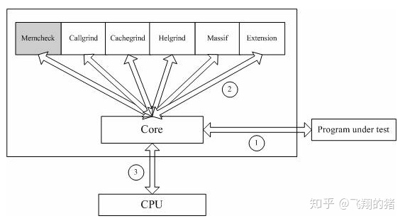

## valgrind 介绍

valgrind 可以用来检测程序中是否存在非法使用内存的问题，如访问未初始化的内存、访问数组越界、忘记释放动态内存等问题。

valgrind是一套Linux下，开放源代码（GPL V2）的仿真调试工具的集合。Valgrind由内核（core）以及基于内核的其他调试工具组成。内核类似于一个框架（framework），它模拟了一个CPU环境，并提供服务给其他工具；而其他工具则类似于插件 (plug-in)，利用内核提供的服务完成各种特定的内存调试任务。Valgrind的体系结构如下图所示：



## valgrind 工具

* Memcheck。这是valgrind应用最广泛的工具，一个重量级的内存检查器，能够发现开发中绝大多数内存错误使用情况，比如：使用未初始化的内存，使用已经释放了的内存，内存访问越界等。这也是本文将重点介绍的部分。

* Callgrind。它主要用来检查程序中函数调用过程中出现的问题。

* Cachegrind。它主要用来检查程序中缓存使用出现的问题。

* Helgrind。它主要用来检查多线程程序中出现的竞争问题。

* Massif。它主要用来检查程序中堆栈使用中出现的问题。

* Extension。可以利用core提供的功能，自己编写特定的内存调试工具。

### 检测内存泄漏

以下程序
```c
TEST_F(cpp_basics_test, valgrind_detect) {
    int * ptr = static_cast<int *>(malloc(sizeof(int)));
}
```
运行以下命令

`usr/bin/valgrind --tool=memcheck --gen-suppressions=all --leak-check=full --leak-resolution=med --track-origins=yes --vgdb=no /tmp/tmp.tkjaIcmPA9/cmake-build-debug/bin/cplusplus_basics_test --gtest_filter=cpp_basics_test.valgrind_detect --gtes_color=no`

得出结果

```text
==4150380== Memcheck, a memory error detector
==4150380== Copyright (C) 2002-2017, and GNU GPL'd, by Julian Seward et al.
==4150380== Using Valgrind-3.15.0 and LibVEX; rerun with -h for copyright info
==4150380== Command: /tmp/tmp.tkjaIcmPA9/cmake-build-debug/bin/cplusplus_basics_test --gtest_filter=cpp_basics_test.valgrind_detect --gtes_color=no

==4150380== HEAP SUMMARY:
==4150380==     in use at exit: 5 bytes in 2 blocks
==4150380==   total heap usage: 855 allocs, 853 frees, 161,254 bytes allocated
==4150380==
==4150380== 4 bytes in 1 blocks are definitely lost in loss record 2 of 2
==4150380==    at 0x483B7F3: malloc (in /usr/lib/x86_64-linux-gnu/valgrind/vgpreload_memcheck-amd64-linux.so)
==4150380==    by 0x41DCB3: cpp_basics_test_valgrind_detect_Test::TestBody() (cpp_basics_test.cpp:810)
==4150380==    by 0x47CA57: void testing::internal::HandleSehExceptionsInMethodIfSupported<testing::Test, void>(testing::Test*, void (testing::Test::*)(), char const*) (in /tmp/tmp.tkjaIcmPA9/cmake-build-debug/bin/cplusplus_basics_test)
==4150380==    by 0x474F44: void testing::internal::HandleExceptionsInMethodIfSupported<testing::Test, void>(testing::Test*, void (testing::Test::*)(), char const*) (in /tmp/tmp.tkjaIcmPA9/cmake-build-debug/bin/cplusplus_basics_test)
==4150380==    by 0x44A0BD: testing::Test::Run() (in /tmp/tmp.tkjaIcmPA9/cmake-build-debug/bin/cplusplus_basics_test)
==4150380==    by 0x44AAFF: testing::TestInfo::Run() (in /tmp/tmp.tkjaIcmPA9/cmake-build-debug/bin/cplusplus_basics_test)
==4150380==    by 0x44B3FC: testing::TestSuite::Run() (in /tmp/tmp.tkjaIcmPA9/cmake-build-debug/bin/cplusplus_basics_test)
==4150380==    by 0x45AD8E: testing::internal::UnitTestImpl::RunAllTests() (in /tmp/tmp.tkjaIcmPA9/cmake-build-debug/bin/cplusplus_basics_test)
==4150380==    by 0x47DE85: bool testing::internal::HandleSehExceptionsInMethodIfSupported<testing::internal::UnitTestImpl, bool>(testing::internal::UnitTestImpl*, bool (testing::internal::UnitTestImpl::*)(), char const*) (in /tmp/tmp.tkjaIcmPA9/cmake-build-debug/bin/cplusplus_basics_test)
==4150380==    by 0x475FD6: bool testing::internal::HandleExceptionsInMethodIfSupported<testing::internal::UnitTestImpl, bool>(testing::internal::UnitTestImpl*, bool (testing::internal::UnitTestImpl::*)(), char const*) (in /tmp/tmp.tkjaIcmPA9/cmake-build-debug/bin/cplusplus_basics_test)
==4150380==    by 0x4594F3: testing::UnitTest::Run() (in /tmp/tmp.tkjaIcmPA9/cmake-build-debug/bin/cplusplus_basics_test)
==4150380==    by 0x490063: RUN_ALL_TESTS() (in /tmp/tmp.tkjaIcmPA9/cmake-build-debug/bin/cplusplus_basics_test)
==4150380==
{
   <insert_a_suppression_name_here>
   Memcheck:Leak
   match-leak-kinds: definite
   fun:malloc
   fun:_ZN36cpp_basics_test_valgrind_detect_Test8TestBodyEv
   fun:_ZN7testing8internal38HandleSehExceptionsInMethodIfSupportedINS_4TestEvEET0_PT_MS4_FS3_vEPKc
   fun:_ZN7testing8internal35HandleExceptionsInMethodIfSupportedINS_4TestEvEET0_PT_MS4_FS3_vEPKc
   fun:_ZN7testing4Test3RunEv
   fun:_ZN7testing8TestInfo3RunEv
   fun:_ZN7testing9TestSuite3RunEv
   fun:_ZN7testing8internal12UnitTestImpl11RunAllTestsEv
   fun:_ZN7testing8internal38HandleSehExceptionsInMethodIfSupportedINS0_12UnitTestImplEbEET0_PT_MS4_FS3_vEPKc
   fun:_ZN7testing8internal35HandleExceptionsInMethodIfSupportedINS0_12UnitTestImplEbEET0_PT_MS4_FS3_vEPKc
   fun:_ZN7testing8UnitTest3RunEv
   fun:_Z13RUN_ALL_TESTSv
}
==4150380== LEAK SUMMARY:
==4150380==    definitely lost: 4 bytes in 1 blocks
==4150380==    indirectly lost: 0 bytes in 0 blocks
==4150380==      possibly lost: 0 bytes in 0 blocks
==4150380==    still reachable: 1 bytes in 1 blocks
==4150380==         suppressed: 0 bytes in 0 blocks
==4150380== Reachable blocks (those to which a pointer was found) are not shown.
==4150380== To see them, rerun with: --leak-check=full --show-leak-kinds=all
==4150380==
==4150380== For lists of detected and suppressed errors, rerun with: -s
==4150380== ERROR SUMMARY: 1 errors from 1 contexts (suppressed: 0 from 0)
```

输出信息中的HEAP SUMMARY，它表示程序在堆上分配内存的情况，其中的 allocs 表示程序分配了多少次内存，frees表示程序释放了多少次内存，bytes allocated表示分配了多少个字节的内存。 另外，Valgrind 也会报告程序是在哪个位置发生内存泄漏。

## 参考
[内存检测王者之剑—valgrind](https://zhuanlan.zhihu.com/p/56538645)
